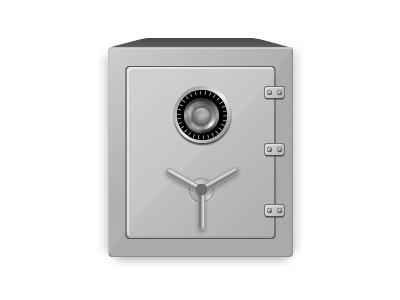

# Safe

An experimental chunk-based backup program. Safe is a proof-of-concept
implementation to explore concepts which may not be addressed fully in
currently available backup programs.

The concepts to be tested include:

- Backup and tracking to multiple destinations before reporting a file as
  "safe"
- Mandatory use of asymmetric (public key) cryptography
- Distributed peer-to-peer backup with friends and family
- Cloud-first storage design for backup files, taking into account the unique
  characteristics of cloud storage providers
- Optional use of hardware-based security keys like SoloKey or YubiKey

Safe stands on the shoulders of and is motivated by the many pioneers in the
chunk-based backup space, including borg, duplicacy, hashbackup, restic, and
kopia.

 

## Commands

Tentative list of major commands:

* safe backup
* safe restore
* safe verify
* safe list | safe ls
* safe find | safe grep
* safe remote
* safe status
* safe info

## Tech Stack
* Python (pytest, coverage)
* blake2b
* AES-GCM-256 (maybe: AES-SIV)
* MessagePack
* GPG/PGP (maybe: age)
